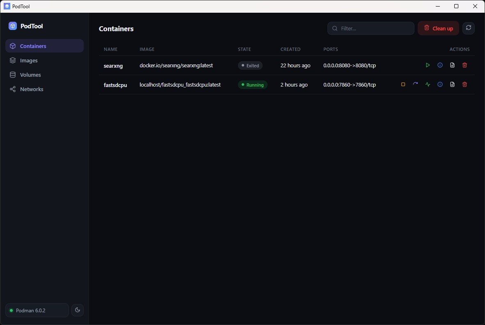

<p align="center">
  
</p>

<h1 align="center">PodTool</h1>

A modern, lightweight, cross-platform desktop app for managing [Podman](https://podman.io) containers, images, volumes, and networks.



## Features

- **Lightweight** — a native OS webview via Tauri, not Electron/bundled Chromium; the whole app is a single binary under 10 MB with no background daemon of its own.
- **Containers, Images, Volumes, Networks** in one place, with start/stop/restart, remove, and a live log viewer (with search and match highlighting) for containers.
- **Clean up** unused containers, images, volumes, and networks in one action.
- **Connection-aware UI** — shows Podman's client version, and offers to start the Podman machine for you if it isn't running.
- **System tray** — closing the window minimizes to tray instead of quitting; single-instance, so relaunching just refocuses the existing window.
- **Light / dark / system theme**, persisted across restarts.

## Requirements

- [Podman](https://podman.io/docs/installation) installed and available on your `PATH`.

## Development

Requires [Node.js](https://nodejs.org) and the [Rust toolchain](https://www.rust-lang.org/tools/install) (plus the platform prerequisites for Tauri — see the [Tauri prerequisites guide](https://tauri.app/start/prerequisites/)).

```bash
npm install
npm run tauri dev            # run in dev mode with hot reload
```

### Building

```bash
npm run tauri build -- --no-bundle   # release binary only, no installer
npm run tauri build                  # release binary + OS installer (.msi/.exe/.dmg/.deb/...)
```

The first `npm run tauri build` (without `--no-bundle`) needs to download the WiX Toolset and NSIS to build a Windows installer. If that download times out on your network, use `--no-bundle` to get a working `target/release/podtool` binary without it.

### Other useful commands

```bash
cd src-tauri && cargo check   # typecheck the Rust backend
npx tsc --noEmit              # typecheck the frontend
```

There's no automated test suite yet — verification is via the commands above plus manually exercising the built app against a real Podman install.

## Tech stack

- **Backend:** Rust, [Tauri v2](https://tauri.app), shelling out to the `podman` CLI.
- **Frontend:** Vanilla TypeScript, no framework — see [`CLAUDE.md`](./CLAUDE.md) for an architecture overview.

## License

[MIT](./LICENSE)
